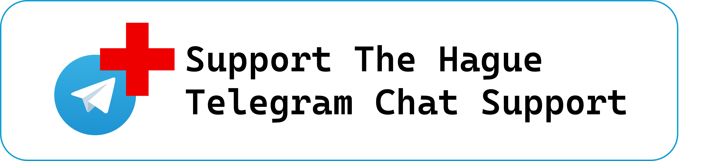

# Refugee Support Telegram Bot

This Telegram bot serves as a support assistant for refugees, providing information about various services including legal help, shelter, medical assistance, and more. The bot is powered by a sophisticated multi-step tool calling agent that interfaces directly with a Sanity.io backend.

## Architecture

### Tool Calling Agent

The bot uses a ToolCallingAgent from the `smolagents` library that orchestrates multiple specialized tools:

1. **GroqQueryTool**: Makes direct queries to Sanity.io API using GROQ (Graph-Relational Object Queries) to fetch information about various services and resources.

2. **GreetingTool**: Handles user greetings and welcome messages, providing a friendly introduction to the bot's capabilities.

3. **UnRelatedQuestionTool**: Manages queries outside the bot's knowledge domain by providing appropriate responses and redirecting users to relevant topics.

4. **More tools can be added**
### Available Categories

The bot can provide information about multiple categories including:
- Shelter and basic needs
- Medical services (doctors, dentists)
- Legal assistance
- Emergency services
- Mental wellbeing
- Children's care
- Financial help
- Work and labor rights
- Sexual health
- Domestic violence support
- And many more...

### Message Handling

The bot processes both text and voice messages:

1. **Text Messages**: 
   - Processes natural language queries
   - Uses GPT-4 for understanding context
   - Returns formatted responses with relevant information

2. **Voice Messages**: 
   - Uses OpenAI's Whisper for transcription
   - Converts audio to text
   - Processes the transcribed text like regular messages

## Features

1. **Natural Language Understanding**: Uses GPT-4 to understand and process user queries
2. **Voice Message Support**: Transcribes voice messages to text
3. **Direct Database Queries**: Real-time information retrieval from Sanity.io
4. **Markdown Formatting**: Structured, readable responses
5. **Error Handling**: Graceful fallbacks for parsing errors

## Setup

1. Install required dependencies from requirements.txt
2. Configure environment variables:
   - TELEGRAM_TOKEN
   - OPENAI_API_KEY
   - SANITY_API_KEY

## Data Schema

The bot uses a structured schema for storing and retrieving information about various services. The schema includes:
- Contact information
- Addresses
- Operating hours
- Emergency contacts
- Additional resources
- Service-specific details
- Multilingual support materials

## Error Handling and Reliability

The bot includes robust error handling and automatic restart capabilities to ensure:
- Continuous operation
- Graceful error recovery
- Session management
- Connection stability

## Usage

Users can interact with the bot using natural language queries about various refugee support services. The bot processes these queries through its tool-calling agent, which determines the appropriate tool to use based on the query content.

Example interactions:
- "Where can I find shelter?"
- "How do I get medical help?"
- "I need legal assistance"
- Voice messages with similar queries

The bot maintains a conversational style while providing accurate, structured information from the Sanity.io database.
